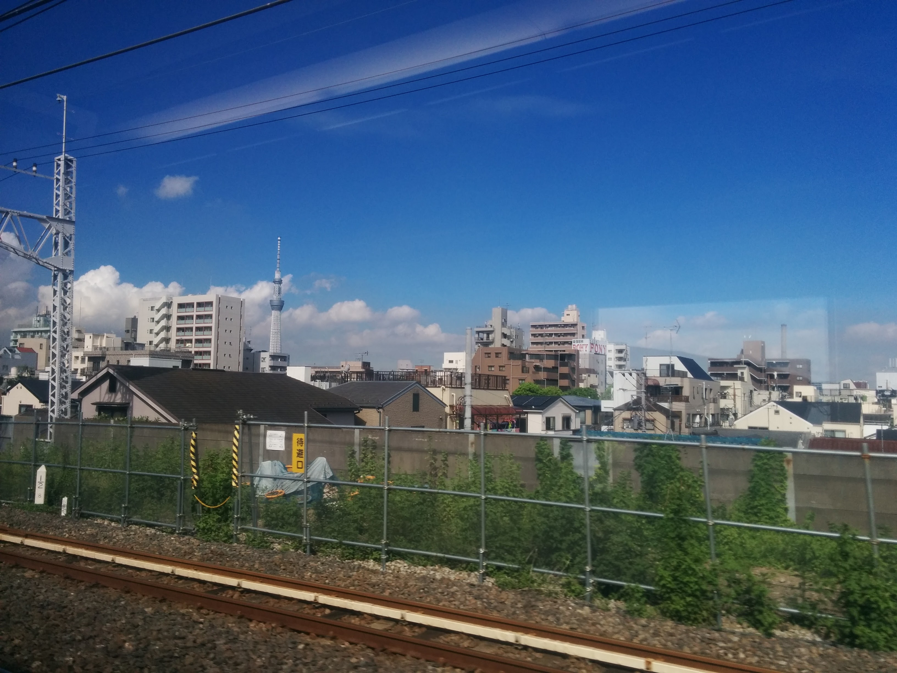
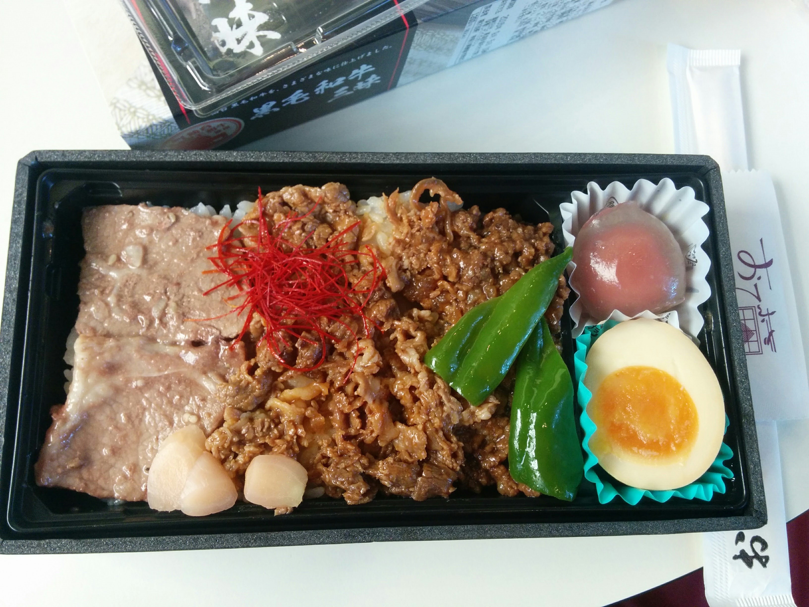
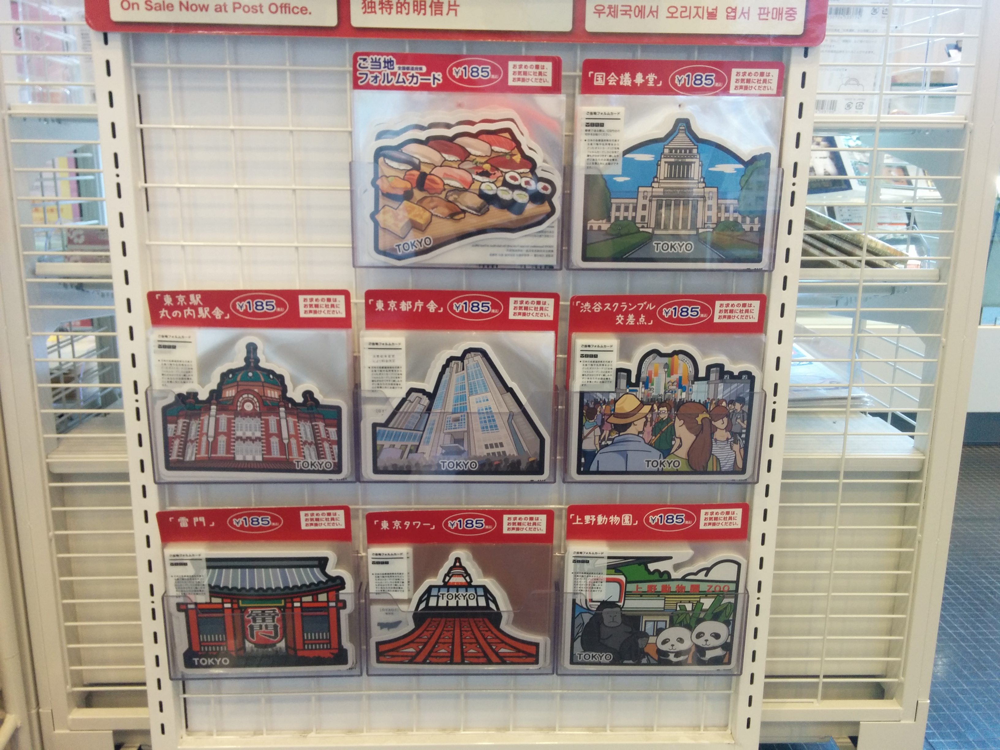
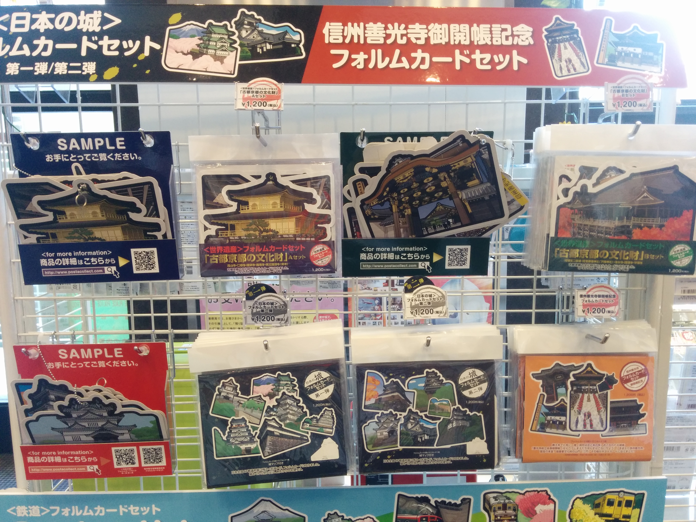
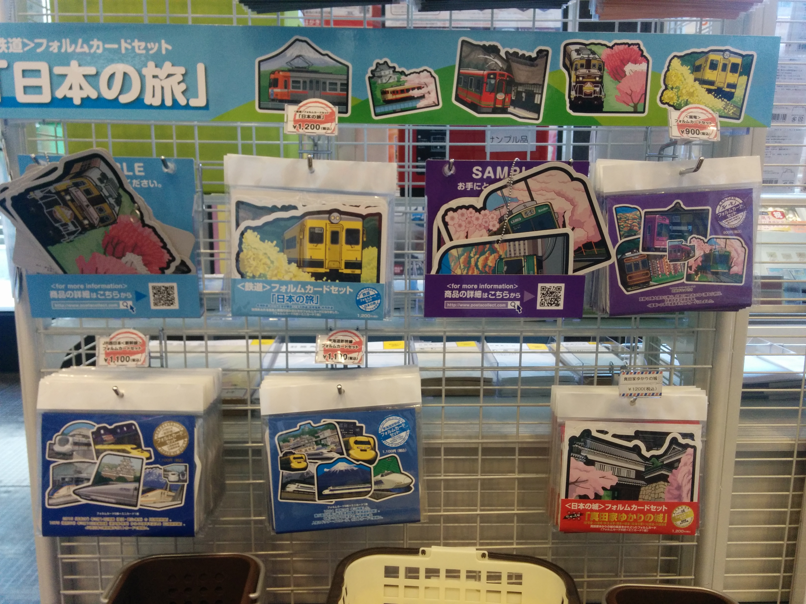

### Day1 Mon. 09/05/16 [Tokyo 東京]
---

06:30 [landed @NRT Airport] -> ~09:00 [Tokyo Station] -> Odaiba onsen

---
After landed around 06:30 am, we picked up our JR passes[1](#jrpass) and pocket Wifi[2](#pocketWifi) and got some cashes[3](#cash) from a ATM at the Narita International Airport. Then we took the Narita Express, covered by our JR Passes, to get to Tokyo!

Trains in Japan are amazing! They are extremely clean, like most things in Japan, and comfortable. I'm not exaggerating when I say Shinkansen is more enjoyable than airplanes.

I enjoyed the view along our ride very much. The sky was blue and clear. We passes some fields and saw a lot of typical, Japanese styled, small houses.

We were a bit tired, after the 13-hours flight, but also excited and ready for the awesome trip ahead of us! Although both Matt and I were a bit hungry after landed, we decided to hold our horses and wait till we get to Tokyo to get our first meal in Japan. "The first meal must to be legit and is worth waiting for!" I said to myself.

After an hour-long ride, we finally arrived at the Tokyo station. It was about 9 am which was apparently a rush hour for people to commute to work. The station was fairly crowded. We saw a tons of food shops: different kind of hot steamed rice, bento box meals, and sweats everywhere!

We had been starving and this led us to believe there were tons of great restaurants outside of the station waiting for us. The station was huge, it took us quite a while to figure out how to get outside. Long story short, after resisting all the temptations from foods inside the station and stumbling our ways through, we finally got out and there was nothing but office buildings and a mall with restaurants opening in about two hours. Matt and I were, in Katherine's words, so grumpy that it scared her.

We got back to the station, failed to navigate back to the part packed with tons of food shops, ended up getting Ekibenes from a small shop, got back to the mall and ate there because the station was so crowded that there was no place for us to sit and eat.

Here comes my first meal in Japan! Looking at the picture still makes me hungry now!

After resting a bit in the mall, we went to the post office. Oh man, look at all these postcards!!!

<a name="jrpass">1</a>: [Japan Rail Pass](http://www.japanrailpass.net/en/about_jrp.html), covers most railways, buses, and ferry boats, is the most economical means of traveling throughout Japan by rail. need to place the order and get a physical exchange order before coming to Japan, the exchange order need to be provided in order to pick up the actual pass after landed in Japan.

<a name="pocketWifi">2</a>: super handy especially if you don't have an international data plan; most of our Airbnb hosts provided their pocket wifi for free, though; we ordered along with our JR passes, but you can also get it at the airport without ordering ahead of time

<a name="cash">3</a>: there are ATMs everywhere in Tokyo and other big cities in Japan, so it's pretty easy to get cash; be aware that besides some extra ATM fee your bank most likely will charge, the ATM you use might also charge some fees. Based on my research, getting US dollars and exchange for Japanese Yen at airports seems to be the most cost efficient way, while getting cash from ATMs is most convenient. Getting Japanese Yen in the US before coming is a bad idea, because the exchange rates provided by banks in the US are not as good as the ones you get in Japan. Here are the [rates provided by the Narita Airport](http://www.narita-airport.or.jp/exchange_e/)
