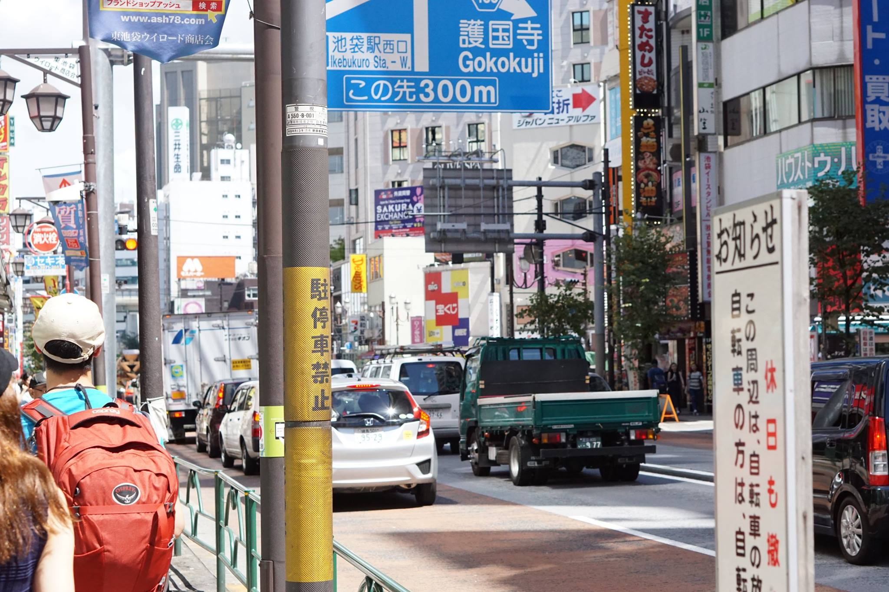
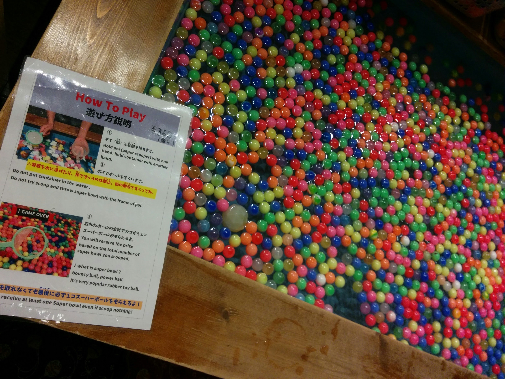

## Day1 Mon. 09/05/16 [Tokyo 東京]
---

06:30         [Landed @NRT Airport](#landed) 
09:00         [Tokyo Station](#tokyo_station) 
10:00 - 12:00 [Food & Post Office](#first_meal) 
12:30 - 13:40 [Ikebukuro Station & Airbnb place](#ikebukuro_station) 
15:40 - 20:30 [Odaiba Onsen](#odaiba_onsen)

---
After we <a name="landed">landed</a> around 06:30 am, we picked up our JR passes[1](#jrpass) and pocket Wifi[2](#pocketWifi) and got some cash[3](#cash) from an ATM at the Narita International Airport. Then we took the Narita Express covered by our JR Passes, to get to Tokyo!

Trains in Japan are amazing! They are extremely clean, like most things in Japan, and comfortable. I'm not exaggerating when I say Shinkansen is more enjoyable than airplanes.

 

I enjoyed the view along our ride very much. The sky was blue and clear. We passed some fields and saw a lot of typical, Japanese styled, small houses.

We were a bit tired after the 13-hours flight, but also excited and ready for the awesome trip ahead of us! Although both Matt and I were a bit hungry after we landed, we decided to hold our horses and wait till we got to Tokyo to get our first meal in Japan. "The first meal must to be legit and is worth waiting for!" I said to myself.

After an hour-long ride, we finally arrived at the <a name="tokyo_station">Tokyo station</a>. It was about 9 am, which is apparently a rush hour for people to commute to work. The station was fairly crowded. We saw tons of food shops: different kinds of hot steamed rice, bento box meals, and sweets everywhere!

We had been starving and this led us to believe there were a lot of great restaurants outside of the station waiting for us. The station was huge; it took us quite a while to figure out how to get out. Long story short, after resisting all the temptations from foods inside the station and stumbling our ways through, we finally got out and there was nothing but office buildings and a mall with restaurants opening in about two hours.
  
 

Matt and I were, in Katherine's words, so grumpy that it scared her. We got back to the station, failed to navigate back to the part packed with food shops, ended up getting Ekibenes from a small shop, got back to the mall and ate there because the station was so crowded that there was no place for us to sit and eat.

 
Here comes my first <a name="first_meal">meal</a> in Japan! Looking at the picture still makes me hungry now 😂

After resting a bit in the mall, we went to the post office. Man, look at all these postcards! 😱
 
 
 
They even have series of postcards for trains 😱

Then we headed to <a name="ikebukuro_station">Ikebukuro Station</a> because the place we were staying for the next three nights, booked through [Airbnb]((https://www.airbnb.com/rooms/4585434)), was about 15 mins from the station.

There was a small cheese tart shop with a long line waiting outside at Ikebukuro Station.
 
 
 
Hot cheese inside 🔥

On our way to the Airbnb place. 
 
 

After checking-in and dropping our bags at our Airbnb place, we were on our way to <a name="odaiba_onsen">Odaiba Onsen</a>, the main event of our first day in Japan!
  

There was a ~25 mins walk[4](#walk) from Teleport Station to Odaiba Onsen. It felt like a pretty long walk for us, mainly because we were tired out by the hot weather 🔥. We even had a small break near the end of the walk and got some foods at a Family Mart, one of the three most common convenient stores in Japan.

We were pretty excited when we finally arrived and gonna spend the rest of the day indoors!
  

The first thing we needed to do, after checking-in, was to figure out our sizes and styles for Yukatas. We were gonna wear them the whole time hanging out in Odaiba Onsen.

Odaiba Onsen was huge inside! Here's the [floor map](https://jonellepatrick.com/oedo-onsen-2/).
  

We started by hanging out in "Town Square":
>[which has been built to resemble an Edo-era town. Lining the “street” are many shops, food stands and restaurants – udon and soba noodles, sushi, unagi (eel), oden, beer, sake, etc.](https://jonellepatrick.com/oedo-onsen-2/)

 
  

Matt and Katherine got crepes, and I got a huge takoyaki:
 
 
 

There were plenty of dining tables:
 

and small shops/game booths:
 

I tried out this traditional game I saw a lot on animations/TV shows!
 

Then we headed to the outdoor foot bath area:
  
Matt & Kath!
 

[Fish Therapy](https://jonellepatrick.me/2013/04/08/weirdest-beauty-treatment-ever/)[5](#fish_therapy), where you let these small fishes clean your feet by nibbling!
 
 

We also made our first friend in Japan, Hoang, who was next to me while my feet were getting nibbled and was also from the Bay Area!

After having enough fun outside, it was onsen[6](#onsen) time!

It was my first time trying out onsen, and it was a lot of fun! It's pretty relaxing and quite liberating 😂
Kath and I tried out all different baths. I always saw people scrubbing each other's backs during onsens in Japanese animations/TV shows, so for the sake of getting a full authentic onsen experience, I decided to give it a try. And man, that was quite an experience. It's like getting a body massage while seeing your dead skin coming off. It's quite refreshing as well, because I basically just laid there for 45 mins.

After onsen, we ordered dipping noodles and ate and chilled in the tatami room.
  
Kath found the milk coffee she had been waiting for for 8 years (and did NOT finish it).
 

That's pretty much all we did in Odaiba Onsen. It was a lot of fun and refreshing, a great start of our Japan adventure!
 

-----
<a name="jrpass">1</a>: [Japan Rail Pass](http://www.japanrailpass.net/en/about_jrp.html), covers most railways, buses, and ferry boats, is the most economical means of traveling throughout Japan by rail. need to place the order and get a physical exchange order before coming to Japan, the exchange order needs to be provided in order to pick up the actual pass after landed in Japan.

<a name="pocketWifi">2</a>: Super handy especially if you don't have an international data plan. Most of our Airbnb hosts provided their pocket wifi for free, though. We ordered it along with our JR passes, but you can also get it at the airport without ordering ahead of time.

<a name="cash">3</a>: There are ATMs everywhere in Tokyo and other big cities in Japan, so it's pretty easy to get cash. Be aware that besides some extra ATM fee your bank most likely will charge, the ATM you use might also charge some fees. Based on my research, getting US dollars and exchange for Japanese Yen at airports seems to be the most cost efficient way, while getting cash from ATMs is most convenient. Getting Japanese Yen in the US before coming is a bad idea, because the exchange rates provided by banks in the US are not as good as the ones you get in Japan. Here are the [rates provided by the Narita Airport](http://www.narita-airport.or.jp/exchange_e/).

<a name="walk">4</a>: We later came to know that Odaiba Onsen actually has shuttles to/from stations.

<a name="fish_therapy">5</a>: Paid by time, worth trying for 30 mins!

<a name="onsen">6</a>: Check out this onsen 101 [video](https://www.youtube.com/watch?v=umyezhyH7qg).
