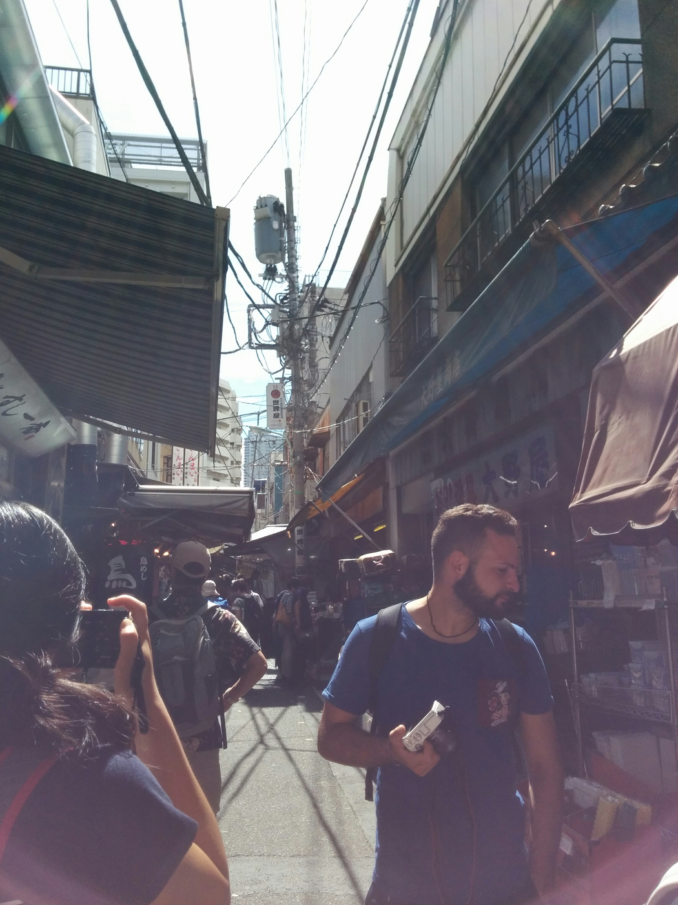
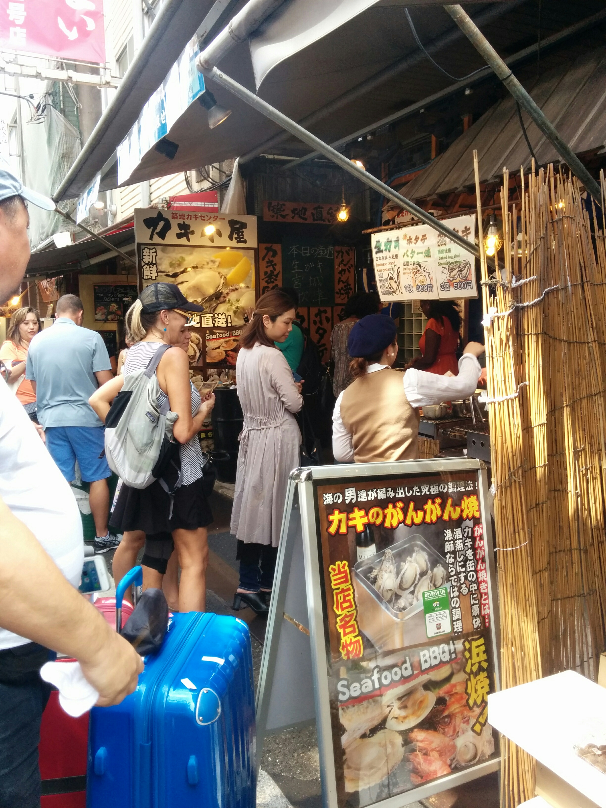
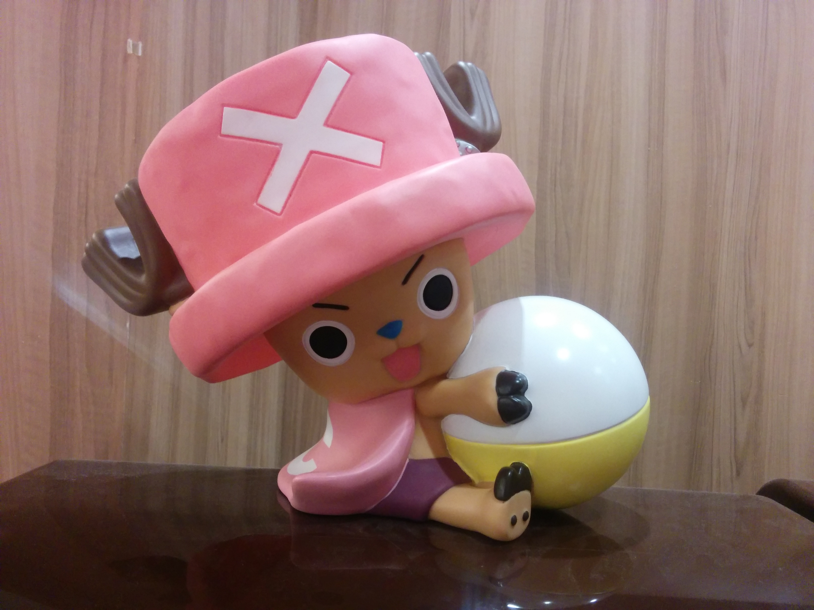
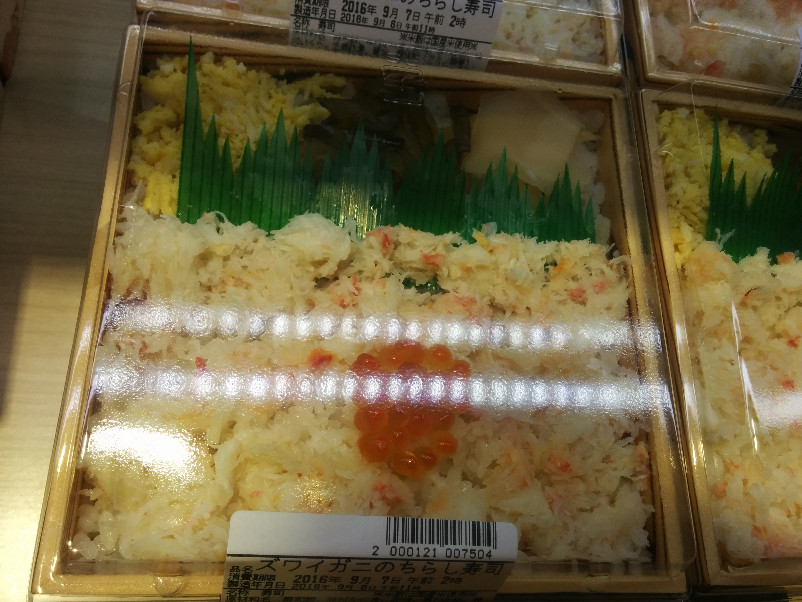
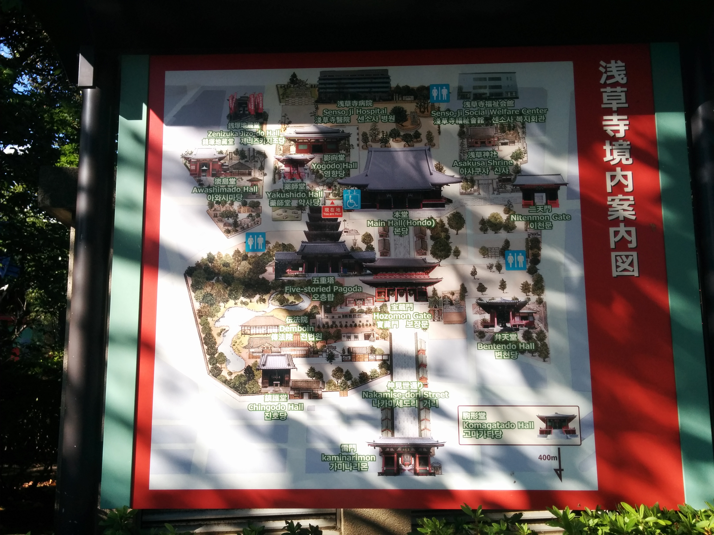
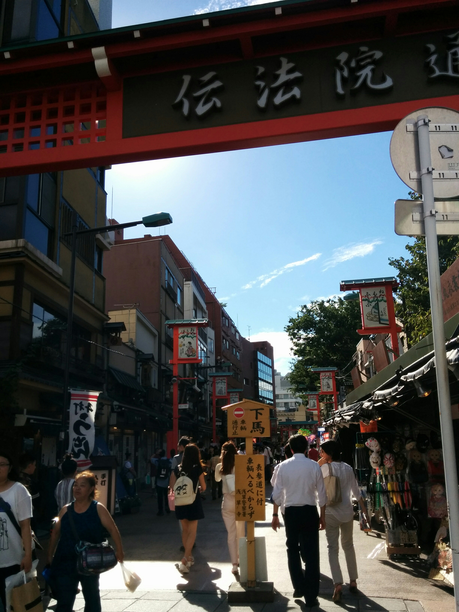

## Day2 Tues. 09/06/16 [Tokyo 東京]
---

10:00 - 11:00 [Tsukiji Fish Market](#fish_market) 
12:00 - 14:20 [Tokyo Skytree Town](#skytree) 
15:00 - 16:00 [Sensō-ji](#temple) 
17:00 - 19:00 [Shinjuku & Fuunji Ramen(風雲児)](#shinjuku) 
20:00         [Department Store](#store)

---
There was no better way to start our second day in Japan than going to <a name="fish_market">the Tsukiji fish market</a>!
> "Tsukiji Market (築地市場, Tsukiji Shijō) is a large wholesale market for fish, fruits and vegetables in central Tokyo. It is the most famous of over ten wholesale markets that handle the distribution of fish, meat, produce and flowers in Tokyo. Tsukiji Market is best known as one of the world's largest fish markets, handling over 2,000 tons of marine products per day." -[Japan Guide](http://www.japan-guide.com/e/e3021.html)

Many tourists will come here by 5 a.m. for the [live tuna auctions](https://www.youtube.com/watch?v=uv5DloVT3iU). Knowing sleep is the second most important thing, after food, in our lives, we saved ourselves the trouble of thinking wishfully, setting a 4 am alarm, turning it off as soon as it rings, and going right back to sleep. Instead, after a great night of sleep, we woke up naturally around 9 am and headed straight to the Tsukiji fish market with only one clear goal in mind: food!

  
 

Walking around the market and being surrounded by food, especially fresh seafood, got me very excited. The 5-year-old inside me was screaming, jumping, and dancing all around the whole time as we were walking through the main street and deciding where we should have our first meal of the day. Many of you should be familiar with the analogy that life sometimes is like walking through a forest knowing that you can only pick one fruit from a tree without knowing what's ahead of you nor the opportunity of returning and picking from a tree you have passed. That's exactly how I felt when we were in the fish market and any other times we had to make a decision related to food in Japan! We could only eat so much each day, and there were so many yummies surrounding and calling us. As a computer science major, I couldn't help but try to collect as much relevant data as possible and run it through my real-time "where-should-we-eat" algorithm[1](#algorithm).

I have to apologize that we didn't take many great pictures in the fish market because it was fairly crowded and all the foods there were screaming for our attention.

 
 
 
Here comes the first thing I got: my all time favorite tamagoyaki（玉子焼き）!

 
 
 
 
Then comes scallop sautéed in butter.

 
There are couple small standing tables in the shop, and we just ate there right after it was cooked! 
I wished I had tried out those fresh sashimi there. I saw someone had tuna cubes with the middle parts still icy.

After enough wondering and calculation, we picked[2](#pick) a small sushi shop and ate there.
 
The "restaurant" was very small. We sat on the other side of it, but that's pretty much it. Most "restaurants" in the midst of the market were about the same size. For some reason, my brain just connects these type of shops with adjectives such as "authentic" or "local"[3](#small).

 
 
Here comes our sashimi bowl and salmon sashimi! 
They were good but a bit pricy and didn't live up to our expectations.

 
We also grabbed some of these before leaving the market😄; one of my favorite snacks in Japan. I miss them!

We then headed to  <a name="skytree">[Tokyo Skytree Town](http://www.tokyo-solamachi.jp/english/floor/)</a>!
  
  
First thing we saw after we got out from the station was a store for this famous banana bread.

The bottom floors of the skytree tower include various areas such as a shopping district, a fashion zone, and a food court.

We randomly walked into a manga/anime shop packed with manga and related products!  
Grown up watching anime, the place recalled a lot of good old times for me.

 
 
 
 
 
So much One Piece stuff!!! 😱😱😱 

 
 
They labeled the actual heights of some famous manga characters. 
I'm pretty sure 越前リョーマ from The Prince of Tennis, the anime that got me into playing tennis, grew over 151cm after middle school.😓 
Matt is about the same heigh as Luffy! lol 😂

 
 
 
One of my favorite anime: Ojarumaru (反斗小王子)! I watched it when I was in preschool living with my aunt and cousin! 😄 I even watched a bit of it on my phone on Youtube when we got back to our airbnb place that day just to recall some good old memories. 😂

 
 
Don't know what his name is[4](#domo), but I saw him everywhere and he is so cute!

Then we went to get in line for getting tickets to go up to the skytree tower. We did some research and watched a Youtube video about the view on top of the tower while waiting in line, and we decided to pass on it. 😂

Before we left, we decided to check out the food court in the bottom of the building and we were so glad we did!
 

The food court is packed with **a lot of** food shops: including sushi, all kinds of rice and cooked dishes, and sweets, all for incredible prices! Hear the 5-year-old inside me screaming?!?! 😱😱😱

 
 
 
 
 
 

 
This colorful rice intrigued me a lot. So I got them along with tofu and pork bellies!

 
Matt got this amazing sushi which was too fishy to him, but it tasted like heaven to me! Definitely one of the best sushi I ever had, even including the other two sushi places we went to later in the trip. It had the perfect thickness and amount of fish. Its texture screamed out how fresh it was and that little bit of ginger in the end of the bite ended the whole experience by taking it to another level. 🐟🐟🐟🙈🙈🙈

After having fun, food, and rest, we were on our way to <a name="temple">Sensō-ji</a>: an ancient Buddhist temple.

 
 
We saw two women in Kimono, and we just couldn't resist taking a picture of them. 🙈

Here comes Sensō-ji.  
 
 
Sensō-ji was huge: it required over an hour to just walk around the whole place.  
Katherine and Matt rested in the shade while I was walking around.  
 
 
 
 
 
 
 
Hello, Mr. Ninja! 
 
 
 
 
A lot of shops were closed when we got there.  
 
 
 
 

It's time for us to go to <a name="shinjuku">Shinjuku</a> for dinner! 
 
A women in pretty Kimono in front of a flower shop in the station.

 
 
 
We first went to Nakajima(中嶋), a [one star michelin](http://gm.gnavi.co.jp/shop/0120162810/) restaurant, without reservation to see if we were lucky enough to get three spots tonight or in a week. According to the lady there, it's *impossible*.

We then decided to go to Fuunji Ramen (風雲児): the chef seemed to be very famous according to the amount of [posts](http://luckypeach.com/guides/the-five-ramen-shops-you-can-and-should-visit-in-tokyo/) and [videos](https://www.youtube.com/watch?v=kNN01hPRSsU) covering it in the internet. The line was long but moved rather quickly. They served pretty fast and people ate their meals fast, too, probably because of the fact that there were people waiting inline literally behind you.  
 
Like many legit restaurants we went to in Japan, the restaurant was pretty small, and we ordered through a machine where you select what you want and put in the coins and it will give you tickets to give to a staff member.  
 
Not fully understanding what all the words meant and fearing of missing out, I ordered the basic ramen with a bunch of toppings. Which turned out to be way too much. Pro tip: just order the basic ramen, it comes with a bit of everything already.

 
Look at the huge portion of noodles I got along with an extra egg, extra seaweed and bamboo sheets.

The broth was **NO JOKE**. The **richest/strongest** ramen broth I ever had.
 
Look at how thick it is!

I saw people first finished half of the broth, then added water into the cup and finished the rest.

The whole experience in Fuunji Ramen was wonderful and authentic: from waiting in line outside of the tiny restaurant, ordering through the machine, waiting in line inside seeing people eating in front of us, watching the chef cooking in front of us after we seated and giving us very warm smiles, to having the richest ramen broth in the world[4](#ramen). I'm very glad that we went there and would say Fuunji Ramen(風雲児) is a must go if you want to have a nice authentic ramen experience! 😄

We were up to ears when we left the restaurant. We then went to a fancy <a name="store">department store</a> where Matt fell in love with an long blue jean coat but did not get it because the price was a bit unreasonable[5](#coat). We also rested in chairs at a Muji store for a while without shame before heading home. 😂

-----
<a name="algorithm">1</a>: I learned that, sadly, neither dfs nor bfs works in real life, since there's no playback nor fast-forward in life. Greedy algorithm, which does not guarantee to produce the most optimal solution, in many cases seems to be our best bet.

<a name="pick">2</a>: To be honest, the main reason I picked it was because there were some photos of people, which seemed to be celebrities, eating at the restaurant hanging outside of it.

<a name="small">3</a>: Which turned out to be somewhat true: throughout the trip, we noticed the pattern that small restaurants that only offer one type of food were normally pretty darn good!

<a name="domo">4</a>: It's Domo according to [Vivien](http://vivngo.xyz/).

<a name="ramen">5</a>: I probably did it the wrong way by eating it too fast or something, my tongue was a bit numb after the meal and I did not finish the broth nor the noodles. 😂

<a name="coat">6</a>: The remaining shopping parts in the trip consistently had one theme for Matt: find the exact same coat at a more reasonable price.
